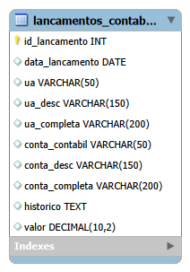

# banco-lancamentos-contabeis
Estrutura de banco de dados para armazenamento de lançamentos contábeis utilizada em projeto acadêmico de Banco de Dados e Machine Learning.
## Diagrama do Banco de Dados



## Como executar o banco

1. Execute o arquivo `script_banco.sql` para criar o banco e a tabela.
2. Execute o arquivo `exemplo_dados.sql` para inserir dados de exemplo.
3. Utilize consultas SQL para visualizar os dados, como:

```sql
SELECT * FROM lancamentos_contabeis;
